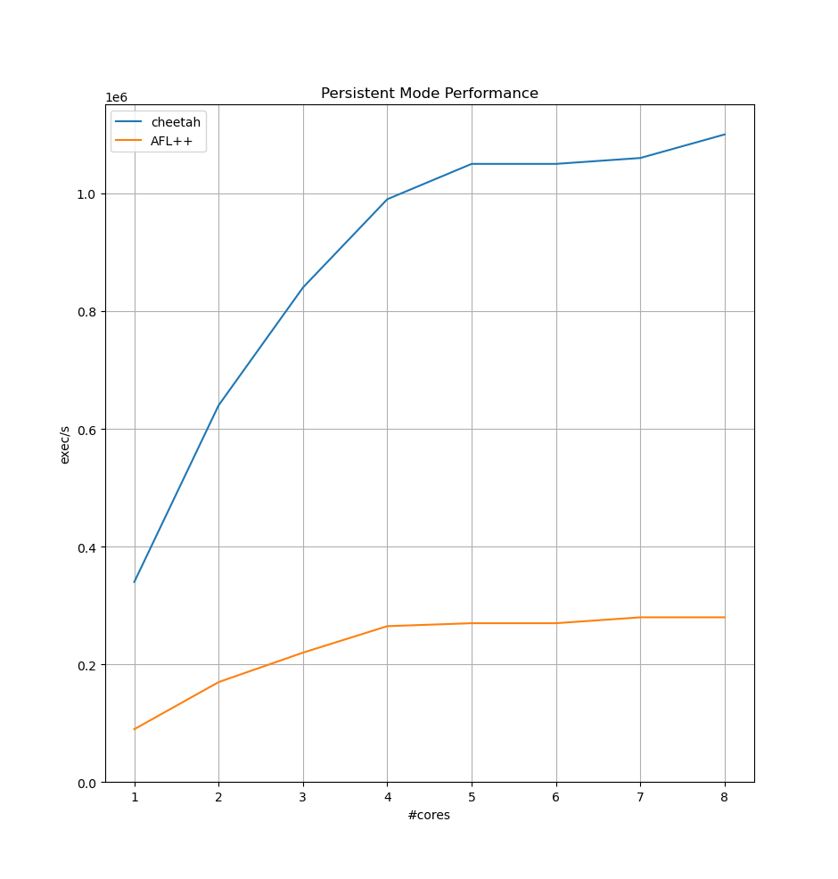

# cheetah

My personal, high-performance fuzzer runtime that implements a forkserver, persistent mode and passing fuzz inputs
over shared memory.

## Features
- Persistent mode with 75% less overhead than AFL++ while maintaining the same feature set
- Compatible with AFL++'s coverage instrumentation
- Rust bindings for LibAFL integration

## Usage
Create `libruntime.so` by invoking
```
make
```
optionally with custom `CC` and `CFLAGS` environment variables.

Add `./include/` to your include path when compiling your fuzz target.

## API
To use `libruntime.so`, include the header file
```
#include <fuzzer-runtime.h>
```

Then, you can make use of the following API:

| Function | Explanation |
|----------|-------------|
| `void spawn_forkserver (void)` | Equivalent to `__AFL_INIT` |
| `int spawn_persistent_loop (size_t iterations)` | Equivalent to `__AFL_LOOP` but no prior `spawn_forkserver()` is necessary |
| `MAX_ITERATIONS` | Convenience macro to do as many iterations as possible in `spawn_persistent_loop()` |
| `unsigned char* fuzz_input_data (void)` | Get a pointer to the fuzz data when it is being passed over shared memory, equivalent to `__AFL_FUZZ_TESTCASE_BUF` |
| `size_t fuzz_input_len (void)` | Length of fuzz input, equivalent to `__AFL_FUZZ_TESTCASE_LEN` |

## Benchmark
On my `Intel(R) Core(TM) i5-10210U CPU @ 1.60GHz` I get the following results when measuring the overhead of the
persistent loop:



The benchmark measures the `exec/sec` for empty persistent loops:
```c
__AFL_INIT();
while (__AFL_LOOP((unsigned int) 0xFFFFFFFF));
```
and
```c
while (spawn_persistent_loop(MAX_ITERATIONS));
```
The fuzzers for each target are built with LibAFL and are designed to be
as similar as possible. They only differ in the `Executor` in use.
For the AFL++ setup, a `ForkserverExecutor` with shared-memory testcases
was used and for the Cheetah setup, an `InProcessExecutor` was used that
utilized Cheetah's rust bindings directly.

The exact setup is:
```
make
AFL_PATH=<your afl path> make -C tests
```
and then run the benchmarks with
```
cd bindings
CORES=<core speficiation> cargo test --release bench_afl -- --nocapture
CORES=<core speficiation> cargo test --release bench_libruntime -- --nocapture
```
